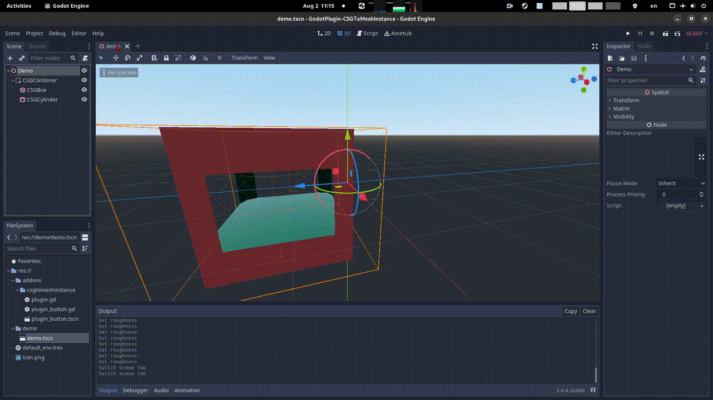

# CSG To MeshInstance (Godot Plugin)

This is a CSG to MeshInstance converter for Godot

# How to use

- Use version related to your Godot version: 3.5 or 4.0 (main branch)
- Add the `csgtomeshinstance` folder into your Godot addons folder (`res://addons/csgtomeshinstance`)
- Enable the addon in `Project/Project Settings/Plugins`
- Select a CSG root node in your scene tree, a `CSG to MeshInstance` button will appear in the 3D view top menu
- Click on the button to convert !
